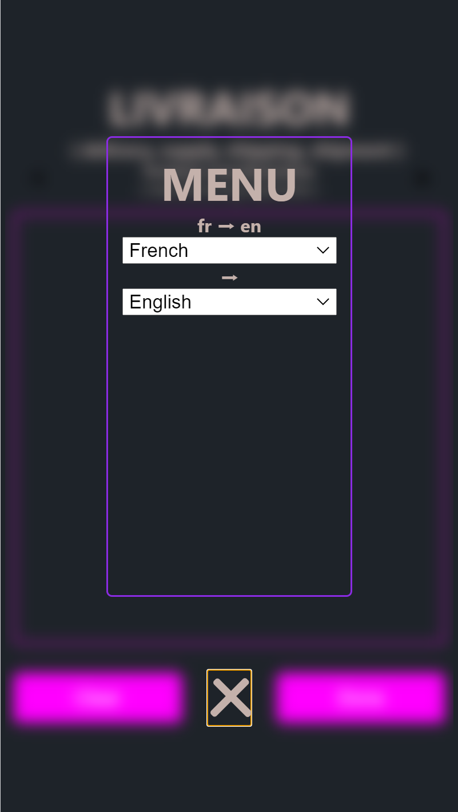

# Word Scenes
Want to expand your vocabulary? Drawing a scene is a tried a true way to enhance memory! It's derived from the Link Memory Method.

Let's say you want to build your French vocabulary and you are a native English speaker. The app will fetch two things: 
1. A random French word with English translation 
2. A French sentence using that word along with English translation. 

The point is to draw a scene related to that word or sentence then submit it. 
Every once in a while, the app will throw the illustration back to you asking what word was associated with it.

## Demo

## Prerequisites
Before you begin, ensure you have the following:
* Internet connection
* A code editor like Visual Studio Code
* NodeJS from https://nodejs.org/en/download/
* Make sure you're not using CMD or PowerShell to run terminal commands.

## Getting Started
To install Word Scenes, open your terminal and run these commands:
1. cd projects
2. cd client 
3. npm i -D @types/react
4. npm i react @types/react-dom
5. npm install
6. npm i @types/redux
7. npm i @types/react-redux
8. yarn install
9. yarn start

# Features
## Language Compatibility
Word Scenes supports 5 languages:
1. English
2. French
3. Italian
4. Russian
5. Spanish

## Phone Compatibility

## Contributing to Word Scenes
To contribute to Word Scenes, follow these steps:
1. Fork this repository.
2. Create a branch: git checkout -b <branch_name>.
3. Make your changes and commit them: git commit -m '<commit_message>'
4. Push to the original branch: git push origin <project_name>/<location>
5. Create the pull request.
6. Alternatively see the GitHub documentation on creating a pull request.